# Apache Kafka - Message Queue Assíncrona

A comunicação inter-microsserviços pode ser realizada tanto sincronamente (Restful), quanto assincronamente.
Neste tutorial, serão exploradas as funcionalidades do Kafka: Uma plataforma de streaming distribuído, que pode ser utilizado como uma Message Queue assíncrona para recepção e envio de mensagens entre os microsserviços.

A arquitetura básica do Kafka é organizada em torno de alguns termos chaves: topics, producers, consumers e brokers.

Todas as mensagens Kafka são organizadas em tópicos. Se você deseja enviar uma mensagem, você a envia para um topic específico. Do mesmo modo, se você deseja ler uma mensagem, você a lê de um topic específico. Um consumer faz pull de mensagens de um topic, enquanto os producers fazem push de mensagens para o topic. Por fim, o Kafka é um sistema distribuído, portanto, opera em cluster. Cada nó do cluster é chamado de Kafka broker.

Os topics são divididos em partições. As partições recebem as mensagens enviadas pelos producers, e as armazenam para que os consumers possam acessá-las.


Para mais detalhes em relação à arquitetura do kafka, acesse (Recomendo fortemente a leitura desses sites): 
https://kafka.apache.org/intro
https://confluentinc.wordpress.com/2015/04/07/hands-free-kafka-replication-a-lesson-in-operational-simplicity/


Há ainda outro elemento importante, o Zookeeper. Esse serviço é responsável por fazer o gerenciamento do cluster de brokers. (https://zookeeper.apache.org/)


Neste tutorial iremos criar três estruturas, cada uma rodando em instâncias EC2 distintas, e todas dentro de containers:
- Um cluster com 3 brokers de Kafka;
- Um cluster com 3 instâncias de zookeeper para fazer o gerenciamento do cluster de brokers;
- Um serviço que atua como Producer e Consumer que interage com um topic criado dentro do cluster de kafka.

A ideia de criar cluster de brokers está atrelada à necessidade de se obter uma estrutura de alta disponibilidade. Caso um Broker do cluster falhe, os demais continuam atendendo as requisições dos producers e do consumers. E, devido ao mecanismo de replicação dos brokers, as mensagens que estavam armazenadas no broker que falhou, também se encontram armazenadas nos demais brokers, desse modo, não há perda de mensagens durante a ocorrência de falhas.

O cluster de zookeeper possui propósito similar. Como a sincronização entre os brokers do kafka é feita por ele, se o zookeeper cair, o serviço de mensagens pararia de funcionar. Por essa razão, são implementados 3 zookeepers em conjunto. Desse modo, caso ocorra a falha de um, os outros dois operantes conseguem manter o cluster de broker funcionando corretamente.

### Parte 1 - Criação das instâncias AWS em que os serviços irão rodar

Primeiramente acesse o painel EC2, e clique no botão LAUNCH INSTANCE, como exemplificado na figura abaixo. 

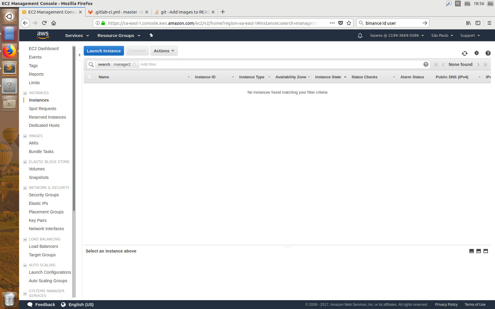

Em seguida é necessário escolher um sistema operacional, no caso pode-se escolher qualquer sistema baseado em linux, no caso foi selecionado uma imagem ubuntu, o quarto
elemento na lista.

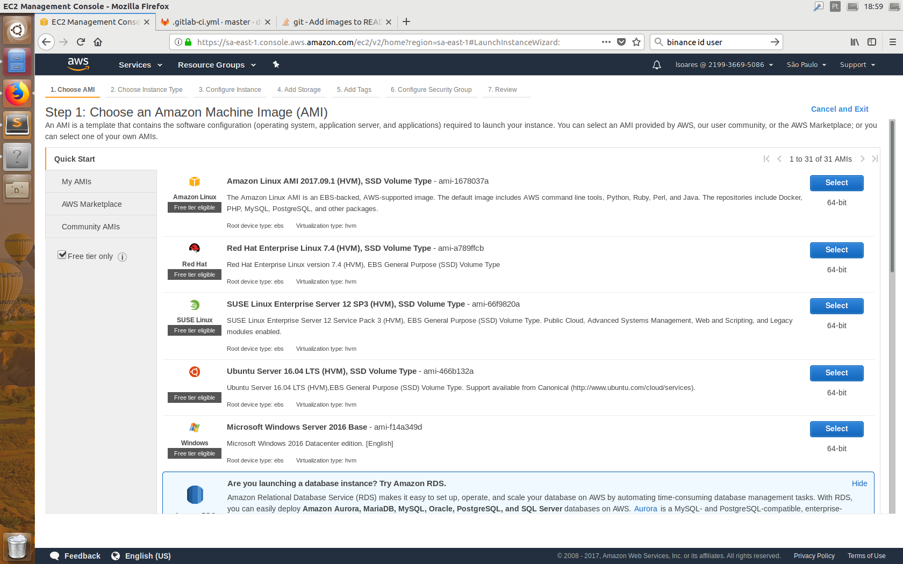

Na próxima tela são mostradas as diferentes máquinas disponíveis. Para não ter problemas com utilização de memória, selecione uma instância small. Escolha a instância e clique em "Next:Configure Instance Details", onde pode-se manter as configurações padrões e logo em seguida clique em "Next: Add Storage", onde pode-se manter as configurações padrão. Em seguida clique em "Next: Add Tags".  

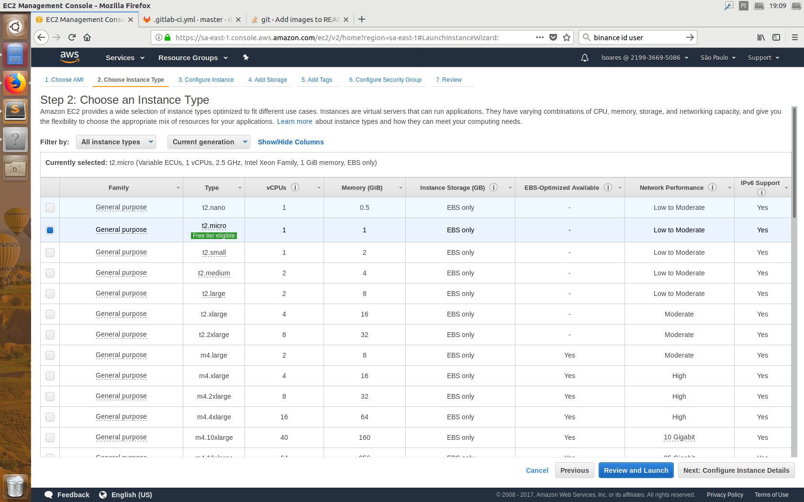


Nesta etapa adicione uma TAG a sua máquina, onde será possível identificá-la mais facilmente. Clique em Add Tag e coloque o valor "Name" para a campo no campo Key e um nome para a máquina no campo Value. Em seguida clique em "Review and Launch". 

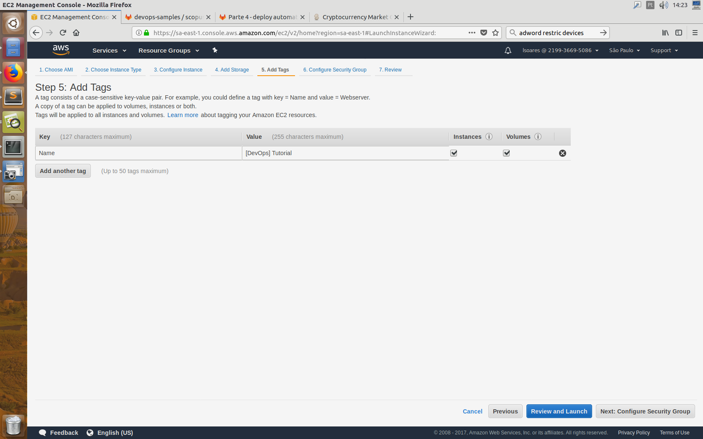


Agora basta rever se as configurações escolhidas estão corretas e clicar no botão para inicia-lá. Pronto, agora dentro de um pequeno intervalo a instância será preparada e lançada, esta pode ser vista no painel de instâncias EC2.

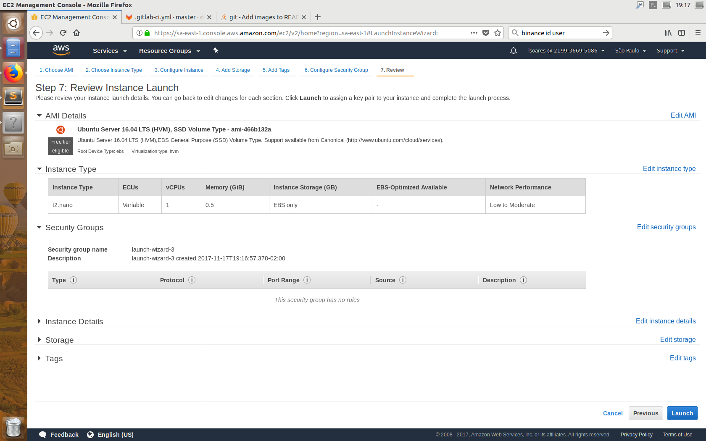

Repetir esse processo 3 vezes, assim criando 3 instâncias disintas. 

Para facilitar a identificação, clique em instances no menu a direita e altere o nome das instâncias, como mostrado na figura abaixo:

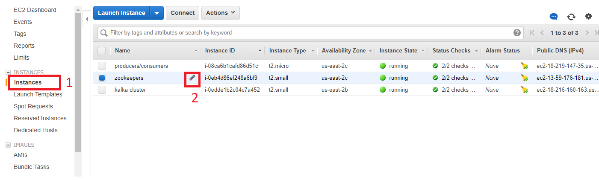


## Requerimentos
Para executar esse tutorial, é necessário o Docker e o Docker Compose nas instâncias.
Conecte-se por ssh nas instãncias e execute os comandos abaixo

Instalação Docker:

```bash
curl -fsSL get.docker.com -o get-docker.sh
sh get-docker.sh
sudo usermod -aG docker ubuntu
```
Deslogue das instâncias e logue novamente para que sejam garantidos privilégis de administrador para a execução dos comandos docker.

Instalação Docker Compose:

```bash
sudo curl -L https://github.com/docker/compose/releases/download/1.20.1/docker-compose-$(uname -s)-$(uname -m) -o /usr/local/bin/docker-compose
```

### Parte 2 - Criação do cluster de Zookeeper

Para a criação deste cluster, será necessário o arquivo docker-compose.yml que se encontra dentro do diretório Zookeeper Cluster deste repositório.
(Os outros diretórios desse repositório referem-se às outras instâncias)


Dentro do diretório Zookeeper Cluster Execute o comando: 
```bash
docker-compose -f docker-compose.yml up 
```

Pronto, seu cluster de zookeeper está operante, e você deve observar um output similar à figura abaixo:


### Parte 3 - Criação do cluster de Brokers

Vamos agora criar o cluster de Brokers do Kafka. Para tanto, obtenha o docker-compose.yml que se encontra dentro do diretório Broker Cluster deste repositório.

Até o dado momento, não foi verificado como será a integração do kafka com o kubernetes, por esta razão, a conexão entre o cluster de broker e o cluster de zookeeper foi feita hardcoded dentro do arquivo docker-compose.yml. Sendo assim, para que essa conexão ocorra de forma correta, é necessário alterar o valor do campo "KAFKA_ZOOKEEPER_CONNECT:" para o endereço do host do cluster de zookeeper no formato HOST:2181. O endereço do host pode ser visualizado no console AWS, como mostrado na figura abaixo.

Após alterado os valores do campo mencionado acima, podemos criar o cluster.

Dentro do diretório Broker Cluster execute o comando:
```bash
docker-compose -f docker-compose.yml up 
```

O output deve ser similar ao da figura abaixo:
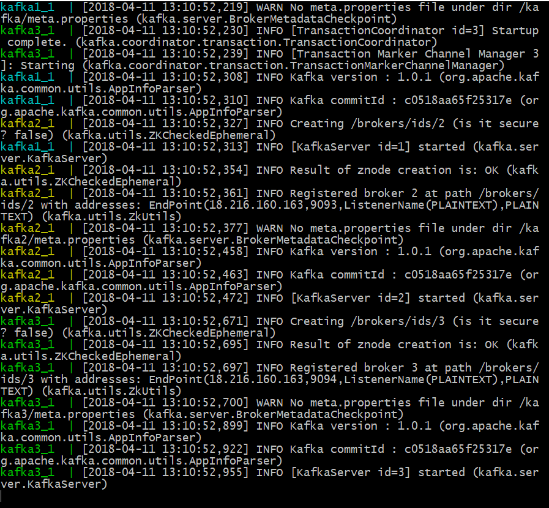

Ao fim desta etapa, seu cluster de brokers estará cadastrado no cluster de zookeepers e pronto para servir como uma message queue a producers e consumers.

### Parte 4 - Criação do serviço de Consumer/Producer

O serviço dessa parte foi criado de acordo com: http://javasampleapproach.com/java-integration/distributed-system/how-to-start-spring-kafka-application-with-spring-boot#IV_Sourcecode

Para fazer a conexão entre o producer e os brokers, foi criada a classe SenderConfig.java. Do mesmo modo, para o consumer foi criada a classe KafkaConsumerConfig.java

Além disso, para testar o conceito de consumer-group (consumers distintos que estão inscritos no mesmo topic e recebem mensagens de partitions distintas), criou-se um Consumer2.

Nesse serviço, assim como no caso do cluster de kafka em que foi necessário alterar um endereço hardcoded, você deve atualizar o arquivo application.properties, localizado em src/main/resources desse repositório. No campo kafka.bootstrap-server, coloque o endereço do host contendo o cluster de brokers. (figura abaixo) Novamente, o endereço do host pode ser obtido através do console da AWS.

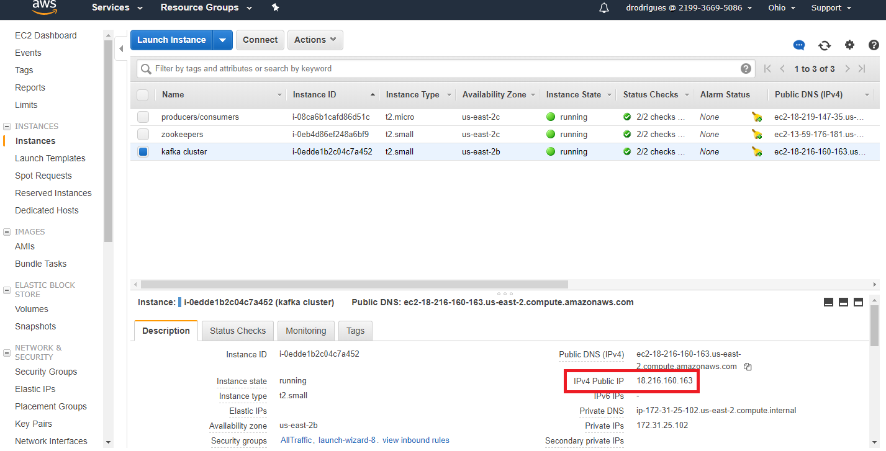

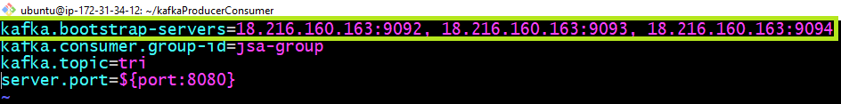

Para rodar esse serviço, execute esses comandos dentro do diretório ProducerConsumerKafka:

```bash
./gradlew build
java -jar build/libs/kafka-0.0.1-SNAPSHOT.jar
```

O output deve ser similar ao mostrado abaixo: 
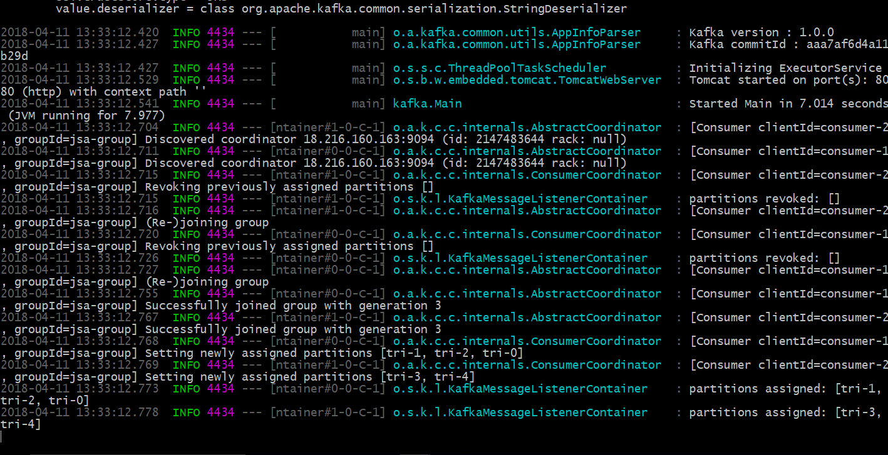


Para testar o serviço, através do browser, basta mandar dados para o endpoint definido no Controller da aplicação, assim como mostrado abaixo:

http://publicDNS:8080/jsa/kafka/producer?data=Test0

OBS: publicDNS corresponde ao DNS público da instância em que esse serviço está rodando (pode ser obtido através do console, como mostrado na figura abaixo). 

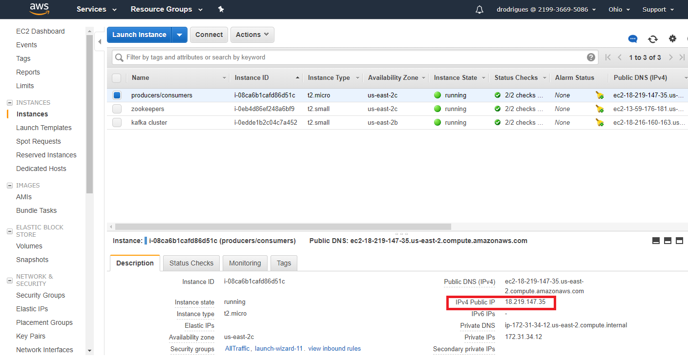


Mande algumas mensagens variando o índice do Test:
http://publicDNS:8080/jsa/kafka/producer?data=Test1
http://publicDNS:8080/jsa/kafka/producer?data=Test2
http://publicDNS:8080/jsa/kafka/producer?data=Test3
http://publicDNS:8080/jsa/kafka/producer?data=Test4

O log exibido pelo serviço deve ser: 

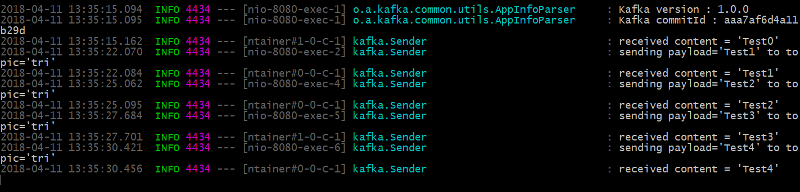


O consumidor 1 pode ser acessado através de 
http://publicDNS:8080/jsa/kafka/consumer

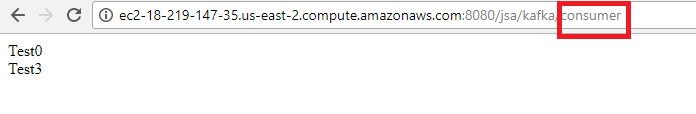


O consumidor 2 pode ser acessado através de
http://publicDNS:8080/jsa/kafka/consumer2

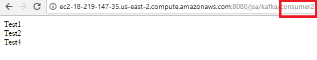


Como pode-se observar, os consumers receberam mensagens diferentes. Isso ocorre pois cada consumidor dentro do consumer group é automaticamente associado a um grupo de partições (No caso, foram criadas 5 partições, onde o Consumer2 foi inscrito nas partições 1,2 e 0; e o Consumer foi inscrito nas partições 3 e 4).

Paralelamente, as mensagens enviadas pelos producers são enviadas a partições diferentes. Por isso os consumers recebem mensagens distintas

É importante destacar que as mensagens não são enviadas necessariamente em ordem para as partições: No caso, a primeira mensagem, Test0, por exemplo, foi enviada para a partição 3.
